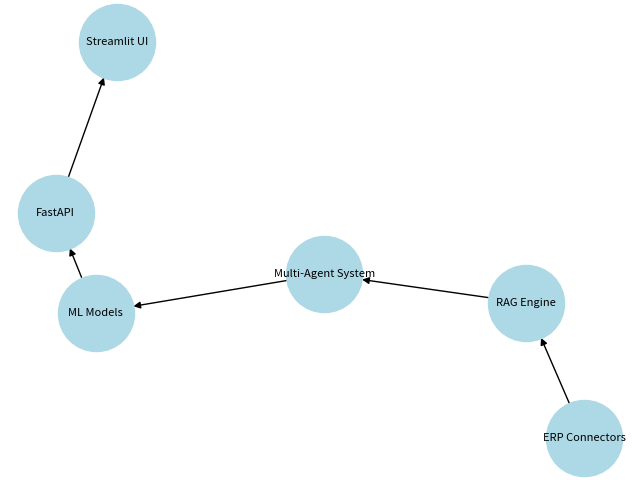

# ERP-AI Platform

**Enterprise AI Platform for ERP Systems** — A production-grade, full-stack AI solution integrating multiple ERPs with intelligent agents, RAG, and advanced ML models.

 multi-agent orchestration, time-series forecasting, explainable AI, and scalable deployment.

 <!-- Add diagram later -->

## ✨ Key Features

- **Multi-ERP Connectors**: ERPNext, Odoo, NetSuite with unified interface
- **Multi-Agent System**: LangGraph-powered agents for Finance, HR, Inventory, Procurement
- **Production RAG**: Advanced retrieval with metadata filtering and hybrid search
- **Advanced ML**:
  - Payroll Anomaly Detection (IsolationForest + SHAP)
  - Inventory & Cashflow Forecasting (Prophet + LSTM ensemble)
  - Vendor Scoring (XGBoost + Explainability)
  - Approval Intelligence (LLM + rule engine)
- **FastAPI + Streamlit Demo**: REST APIs + beautiful interactive UI
- **Docker + MLOps Ready**: Observability hooks, CI/CD friendly
- **Enterprise Ready**: Tests, logging, config management, sample data

## 🚀 Quick Start

```bash
# 1. Clone & setup
cp .env.example .env
# Edit .env with your OPENAI_API_KEY and ERP credentials

# 2. Run with Docker (API + DB)
docker-compose up --build

# 3. Run Streamlit Demo (in another terminal)
streamlit run src/streamlit_app.py
```

Access:
- API: http://localhost:8000/docs
- Demo UI: http://localhost:8501

## Tech Stack

- **Backend**: FastAPI, LangChain/LangGraph, SQLAlchemy
- **AI/ML**: OpenAI, Prophet, XGBoost, scikit-learn, FAISS
- **Frontend**: Streamlit
- **Infra**: Docker, Postgres

## Project Highlights for Portfolio

- End-to-end LLM Agent workflows using LangGraph
- Explainable ML models with SHAP values
- Realistic enterprise use cases with sample data
- Modular, testable, production-ready architecture

---


Contributions & improvements welcome!
